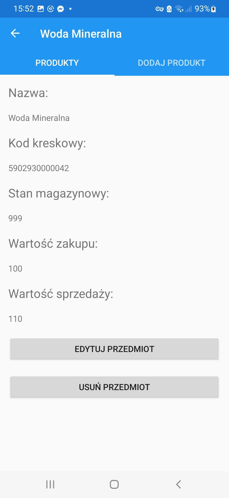
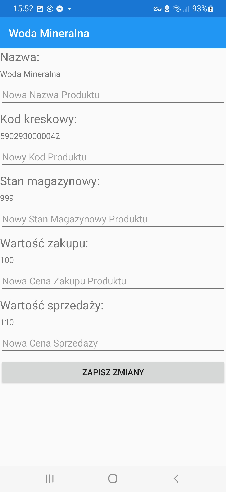
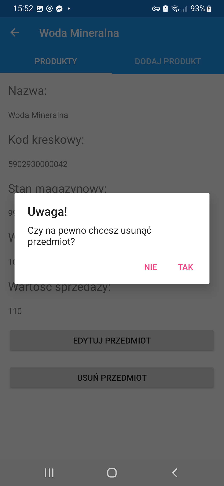
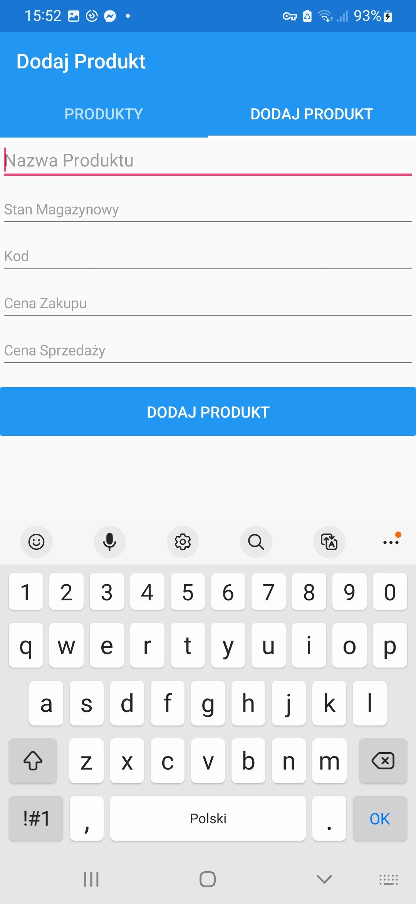
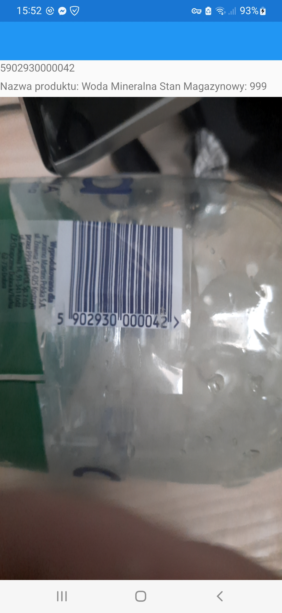
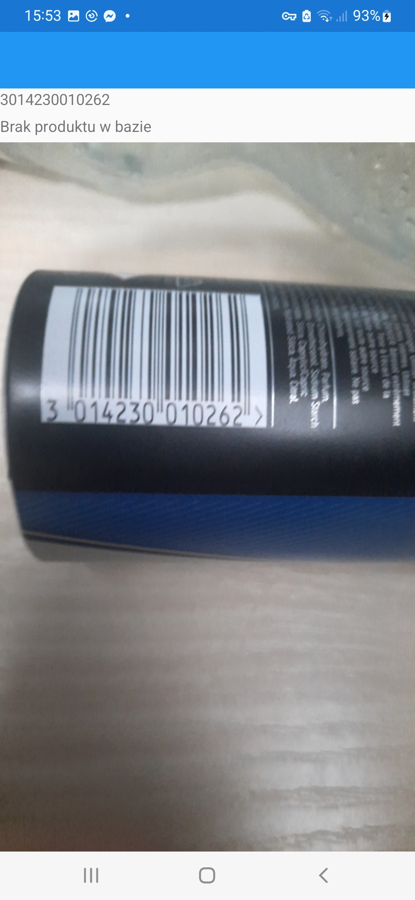

## Warehouse Mobile app ##

Mobile application that helps to manage a warehouse of goods made using C# and Xamarin.Forms.
The application has implemented CRUD methods i.e. creating, reading, updating and deleting a product from the database.
The application also allows you to scan the barcode of a given product using the phone's camera(or other mobile device with a camera), if it exists in the database it displays its name, barcode and the amount of the product in stock, otherwise it displays information that the product does not exist, but you can add it to the database using the application. 
Below are some overview screenshots of the application.

### Screenshots ###
 
 
 
